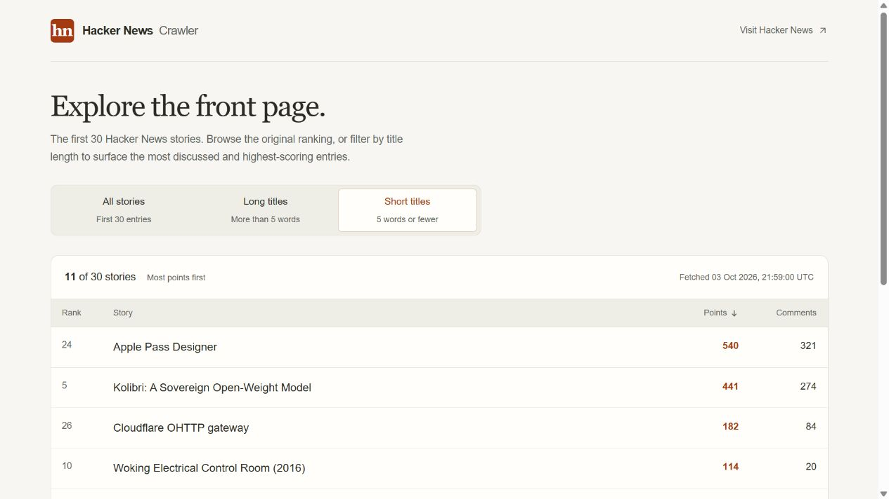

# Hacker News Crawler

Browse the first 30 Hacker News stories in three views, filtered by title length
and ordered by points or comments. A full-stack interview project with a Next.js
interface, a FastAPI HTML scraper, and PostgreSQL usage recording.

**[Try the live demo](http://hn-crawler-zkiluj-3f7b6d-178-104-142-145.traefik.me/)** — deployed with **Dokploy**.



*Captured from the deployed demo on 2026-10-03. Stories, scores, and counts change.*

## Run locally

You only need Docker with Compose for the complete stack.

1. Clone the repository and enter its directory:

   ```sh
   git clone https://github.com/stvdn/hacker-news-crawler.git
   cd hacker-news-crawler
   ```

2. Copy `.env.example` to `.env` and set `POSTGRES_DB`, `POSTGRES_USER`, and
   `POSTGRES_PASSWORD` for your local database.
3. Start the application:

   ```sh
   docker compose up --build
   ```

Open the [web interface](http://127.0.0.1:3000) or
[interactive API docs](http://127.0.0.1:8000/docs). Compose waits for PostgreSQL,
applies migrations, and starts the API and web services. A successful exit from
the one-shot migration container is expected.

Stop with `docker compose down`. Database data stays in the `postgres_data`
volume; adding `--volumes` removes it. For native development, configuration,
migrations, and inspecting stored events, see the [development guide](docs/development.md).

## What to try

| View | Selection | Order |
| --- | --- | --- |
| All stories | First 30 front-page entries | Original rank |
| Long titles | More than five words | Comments descending |
| Short titles | Five words or fewer | Points descending |

Switch views, compare the result counts and fetch timestamps, and try the page
on mobile or with the keyboard. Original ranks stay visible in every view.
Missing metrics appear as an em dash; zero remains zero. Metric ties use the
original rank, and unknown values sort last.

The API exposes the same views independently:

```sh
curl 'http://127.0.0.1:8000/api/v1/entries?filter=long'
```

See the [specification](docs/specification.md) for word-count examples, response
fields, error codes, and usage semantics.

## Engineering decisions

- **One set of business rules.** FastAPI owns selection and ordering. Next.js
  renders the results through server components; URL filters can be bookmarked
  and shared. Plain links avoid prefetch requests that would record unintended
  usage, with full-page navigation as the tradeoff.
- **Small, testable boundaries.** Pure parsing and filtering functions sit behind
  a service with two dependency contracts. Scraping, caching, and persistence
  adapters can be tested independently.
- **Persist before responding.** A successful API response implies a committed
  usage event. This makes database availability and write latency part of serving
  stories. [Persistence decision](docs/adr/0002-usage-persistence.md).
- **Bounded snapshot reuse.** A process-local cache reuses the complete extraction
  for 60 seconds by default, while every request still filters and records usage.
  [Cache decision](docs/adr/0003-snapshot-cache.md).

The stack is Next.js 16, React 19, TypeScript, Tailwind CSS v4 and shadcn/ui on
the frontend; Python 3.13, FastAPI, HTTPX and Beautiful Soup on the backend;
PostgreSQL with async SQLAlchemy and Alembic for persistence.
[Architecture](docs/architecture.md) explains the request flow, frontend choices,
and dependency boundaries.

## Verification

GitHub Actions runs backend lint, types and tests with PostgreSQL; frontend lint,
types, build and Playwright; and a Compose startup smoke check. Ordinary checks
use controlled data and do not contact Hacker News.

After the [native setup](docs/development.md#run-the-api-locally), run from `backend`:

```sh
uv run --locked ruff check .
uv run --locked mypy app tests
uv run --locked pytest
```

After the [frontend setup](docs/development.md#run-the-frontend-locally), run from `frontend`:

```sh
pnpm lint
pnpm typecheck
pnpm build
pnpm exec playwright install chromium
pnpm test:e2e
```

PostgreSQL tests require `TEST_DATABASE_URL`; Playwright also needs the backend
dependencies installed and `uv` on PATH. The [checks guide](docs/development.md#checks)
covers those prerequisites, test isolation, and the optional live scraper check.
The [v1.0.0 verification record](docs/release-verification.md) reports 142 backend
tests passed (one opt-in test skipped) and 12 browser tests passed for the checked
release candidate, plus descriptive timings and their limitations.

## Deployment and limitations

The public demo is hosted with **Dokploy** at the link above. The checked-in
`compose.yaml` provides the local environment; Dokploy domain routing and
platform settings are managed outside this repository.

The scraper depends on Hacker News HTML and rejects incomplete snapshots.
Caching is local to each API process and does not serve expired data after a
failed refresh. Titles are plain text because the API does not expose story
URLs. Usage counts API requests, including reloads, rather than unique people.

## Documentation

| Document | Read it for |
| --- | --- |
| [Specification](docs/specification.md) | Exercise scope, implementation choices, and the current API and business rules |
| [Architecture](docs/architecture.md) | Diagrams, responsibilities, frontend design, and links to the three ADRs |
| [Development guide](docs/development.md) | Setup, configuration, migrations, tests, and measurements |
| [Release verification](docs/release-verification.md) | Dated evidence for the v1.0.0 release candidate |
| [Completed implementation plan](docs/implementation-plan.md) | The eight delivery stages and historical milestones |
