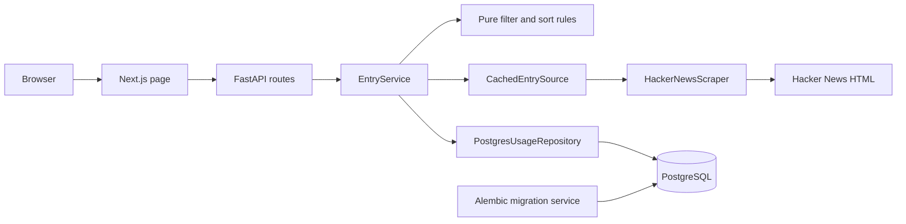

# Architecture

This application shows the first 30 Hacker News front-page stories in three
views and records each valid API request in PostgreSQL. The Next.js page is a
consumer of the FastAPI endpoint; filtering and ordering happen in the backend.

## Responsibilities and dependency direction

| Component | Responsibility |
| --- | --- |
| `frontend/src/app` and `frontend/src/features/hacker-news` | Render the three views, request the API from the server, and display loading, empty, and error states. Requests use `cache: "no-store"`; navigation does not prefetch filter links. |
| `backend/app/api` | Validate the filter, expose the health and entries endpoints, map failures to safe HTTP responses, and serialize Pydantic responses. |
| `backend/app/service.py` | Fetch a snapshot, apply the selected rule, and await one usage write for every valid request before returning or raising an upstream failure. |
| `backend/app/domain` | Define immutable entries, snapshots, and usage events; implement word counting, selection, and ordering; define the `EntrySource` and `UsageRecorder` contracts. |
| `backend/app/adapters/scraper.py` | Fetch fixed-source Hacker News HTML and parse the first 30 story rows, including their adjacent metadata. |
| `backend/app/adapters/cache.py` | Reuse a complete snapshot in one API process for a configurable lifetime and coordinate concurrent refreshes. |
| `backend/app/adapters/usage.py` and `database.py` | Build the database connection and commit a usage event with a separate async session per write. |
| `backend/app/main.py` | Assemble dependencies and own the shared HTTP client and database engine lifetimes. |
| `backend/migrations` and `compose.yaml` | Apply the usage schema before API startup; gate services on migration completion and health checks. |

The domain does not import FastAPI, HTTPX, SQLAlchemy, or adapters. The service
depends on domain contracts, and concrete adapters implement those contracts.
`main.py` connects them at startup. This keeps the rules independently testable
with fixture entries and fake source and recorder implementations. The shared
HTTP client and database engine live for the API lifespan; sessions are created
per usage write so concurrent requests do not share a transaction.

## Request and failure behavior

`GET /api/v1/entries?filter=all|long|short` defaults to `all`. After validation,
the service gets a snapshot, filters and sorts it, records a usage event, and
returns the result. The API gives each request a UUID; `fetched_at` describes
the snapshot, while `cache_hit` describes that request. The all view retains
original rank; long titles sort by comments and short titles by points.

Invalid filters return 422 without an event. A valid request records an event
even when the upstream fetch fails. A timeout returns 504; other upstream HTTP
or parsing failures return 502. If the usage write fails, the API returns 503,
including when the snapshot was cached. Unexpected failures return 500. The
response contains a safe message and request ID; diagnostic details stay in
application logs. A successful response implies the event committed, but a
client retry is a new request and creates another event.

The API health endpoint confirms that the process responds; it does not check
PostgreSQL readiness. Compose checks PostgreSQL health, runs Alembic as a
one-shot service, starts the API after migration success, and starts the web
service after API health. PostgreSQL uses a named volume. These checks and gates
support local Compose startup; they are not a cloud deployment procedure.

## Decisions and tradeoffs

| Concern | Context and choice | Consequence |
| --- | --- | --- |
| Functions, objects, and interfaces | Filtering and parsing are deterministic functions. The service, scraper, cache, and repository own state or resources, so they are classes. Two `Protocol` contracts cover source and usage boundaries. | Small test seams without an interface or class for every operation. Dependency assembly remains explicit in `main.py`. |
| PostgreSQL instead of SQLite | Usage events must persist across restarts and concurrent requests. PostgreSQL is the delivered database, and Alembic owns its schema. | Integration tests need PostgreSQL and must run migrations; SQLite behavior would not prove the delivered path. A successful API response waits for a commit, so database failure reduces availability. |
| HTML scraping | The exercise calls for the visible Hacker News front page. The adapter fetches its HTML rather than using the Hacker News API. | Markup changes can break parsing. Missing ranks or titles and fewer than 30 story rows fail the whole snapshot instead of silently replacing entries. Ordinary tests use saved HTML; a live smoke check is opt-in. |
| Snapshot caching | Switching filters can reuse the same extraction for up to 60 seconds by default. A monotonic clock and async lock control expiry and refresh; zero TTL disables reuse. | Every valid API request still writes usage. Separate API processes would have separate caches; restart clears the cache. An expired snapshot is not served after a failed refresh, and views separated by expiry can differ. |
| Missing metrics | Hacker News can omit points or comment counts; `discuss` means zero comments. Missing values remain `null` in the API and appear as an em dash in the page. | Sorting puts unknown metrics after numeric values and uses original rank for ties. Zero remains distinct from unavailable. |
| Title word count | The filter boundary is five words. A word is a whitespace-delimited token containing a Unicode letter or digit; punctuation within a token does not split it. | Numeric tokens count, symbol-only tokens do not, and a hyphenated expression without spaces is one token. The rule is explicit and deterministic, though it is not linguistic word segmentation. |

The accepted decisions are expanded in [ADR-001](adr/0001-modular-architecture.md),
[ADR-002](adr/0002-usage-persistence.md), and
[ADR-003](adr/0003-snapshot-cache.md). See the
[implementation plan](implementation-plan.md) for the full acceptance criteria.

## AI assistance and validation

AI assistance was used to draft code and documentation. The architecture above
was checked against the repository's current modules, Compose configuration,
and automated checks. The release verification record reports which checks
actually ran and the limits of the measurements; it should be read as the
evidence for this release, not as a claim of independent human review.
