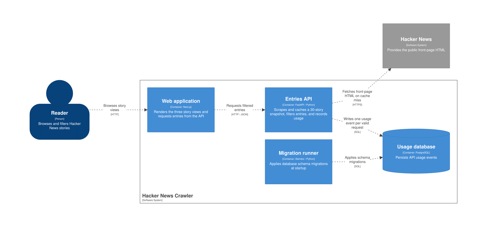
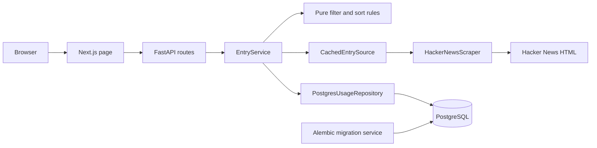

# Architecture

This application shows the first 30 Hacker News front-page stories in three
views and records each valid API request in PostgreSQL. The Next.js page is a
consumer of the FastAPI endpoint; filtering and ordering happen in the backend.

## Container design (before coding)

This C4 container diagram is the design artifact prepared before coding. It
shows the planned application boundaries and external dependencies. The
[Structurizr DSL](architecture.dsl) is its editable source, and the image below
is the [exported SVG](containers.svg).

The web application calls the API from the Next.js server. The snapshot cache
is in the API process; PostgreSQL stores usage events in a persistent Compose
volume. The migration runner is a one-shot service that must finish before the
API starts.

## Implemented workflow

The following view traces the current code's request path inside those
containers, including the process-local cache and usage recording.

## Responsibilities and dependency direction

| Component | Responsibility |
| --- | --- |
| `frontend/src/app` and `frontend/src/features/hacker-news` | Render the three views, request the API from the server, and display loading, empty, and error states. Requests use `cache: "no-store"`; navigation does not prefetch filter links. |
| `backend/app/api` | Validate the filter, expose the health and entries endpoints, map failures to safe HTTP responses, and serialize Pydantic responses. |
| `backend/app/service.py` | Fetch a snapshot, apply the selected rule, and await one usage write for every valid request before returning or raising an upstream failure. |
| `backend/app/domain` | Define immutable entries, snapshots, and usage events; implement word counting, selection, and ordering; define the `EntrySource` and `UsageRecorder` contracts. |
| `backend/app/adapters/scraper.py` | Fetch fixed-source Hacker News HTML and parse the first 30 story rows, including their adjacent metadata. |
| `backend/app/adapters/cache.py` | Reuse a complete snapshot in one API process for a configurable lifetime and coordinate concurrent refreshes. |
| `backend/app/adapters/usage.py` and `database.py` | Build the database connection and commit a usage event with a separate async session per write. |
| `backend/app/main.py` | Assemble dependencies and own the shared HTTP client and database engine lifetimes. |
| `backend/migrations` and `compose.yaml` | Apply the usage schema before API startup; gate services on migration completion and health checks. |

The domain does not import FastAPI, HTTPX, SQLAlchemy, or adapters. The service
depends on domain contracts, and concrete adapters implement those contracts.
`main.py` connects them at startup. This keeps the rules independently testable
with fixture entries and fake source and recorder implementations. The shared
HTTP client and database engine live for the API lifespan; sessions are created
per usage write so concurrent requests do not share a transaction.

## Frontend design

The Next.js App Router page reads the filter from the URL and renders an async
`StoryList` server component. `fetchEntries` is server-only and uses the internal
`API_BASE_URL`, keeping backend addressing out of browser configuration. FastAPI
owns the business rules, so the page and independent API consumers receive the
same filtering and ordering. This adds a web-server hop but avoids duplicating
the rules or maintaining a client-side results store.

Filter controls are ordinary links. Their URLs support bookmarking and sharing,
and they issue a new request even when selecting the active view. They do not
prefetch on hover; together with `cache: "no-store"` on server fetches, this keeps
navigation aligned with request-based usage recording. The tradeoff is full-page
navigation instead of client-side transitions. Reloads also record usage;
request counts are not a count of distinct human actions.

`Suspense` presents a loading state while stories are requested. The results
component handles empty results and safe API errors with a retry link and, when
available, a request ID. Invalid URL filters are rejected before fetching.
The displayed UTC fetch time and result count describe the returned snapshot.

The UI uses a semantic table with row and column headers, `aria-sort` on the
active ordering column, `aria-current` on the selected filter, a skip link, and
keyboard focus styles. Missing metrics have an accessible label and stay distinct
from zero. Responsive styles accommodate narrow screens. Playwright checks the
three views, keyboard navigation, mobile layout, loading and recovery states, and
the absence of hover-triggered usage requests using controlled backend data.

shadcn/ui supplies button and table primitives; Tailwind v4 and CSS tokens in
`frontend/src/app/globals.css` define the visual treatment. Components stay in
`frontend/src/components/ui`, with aliases in `frontend/components.json`.

## Runtime and deployment

The public application is deployed with **Dokploy**; the
[README](../README.md) links to the live demo. Dokploy domain routing and platform
settings are managed outside this repository. The C4 diagram describes the
application boundaries and local Compose services, not the remote host topology.

The API health endpoint confirms that the process responds; it does not check
PostgreSQL readiness. Compose checks PostgreSQL health, runs Alembic as a
one-shot service, starts the API after migration success, and starts the web
service after API health. PostgreSQL uses a named volume, and application and
migration containers run as non-root users. See the
[development guide](development.md) for local setup and operational commands.

The [specification](specification.md) defines API responses, error precedence,
usage events, and freshness. The ADRs below explain why those behaviors were chosen.

## Decisions and tradeoffs

| Concern | Context and choice | Consequence |
| --- | --- | --- |
| Functions, objects, and interfaces | Filtering and parsing are deterministic functions. The service, scraper, cache, and repository own state or resources, so they are classes. Two `Protocol` contracts cover source and usage boundaries. | Small test seams without an interface or class for every operation. Dependency assembly remains explicit in `main.py`. |
| PostgreSQL instead of SQLite | Usage events must persist across restarts and concurrent requests. PostgreSQL is the delivered database, and Alembic owns its schema. | Integration tests need PostgreSQL and must run migrations; SQLite behavior would not prove the delivered path. A successful API response waits for a commit, so database failure reduces availability. |
| HTML scraping | The exercise calls for the visible Hacker News front page. The adapter fetches its HTML rather than using the Hacker News API. | Markup changes can break parsing. Ordinary tests use synthetic HTML fixtures; a live smoke check is opt-in. |
| Snapshot caching | A wrapper reuses the complete extraction across filters. A monotonic clock controls expiry, and concurrent requests share one refresh result or failure. | Less repeated upstream work at the cost of bounded staleness and concurrency logic. Separate API processes have separate caches. |

The accepted decisions are expanded in [ADR-001](adr/0001-modular-architecture.md),
[ADR-002](adr/0002-usage-persistence.md), and
[ADR-003](adr/0003-snapshot-cache.md). The
[specification](specification.md#exercise-scope-and-implementation-choices)
separates the exercise scope from implementation choices.
